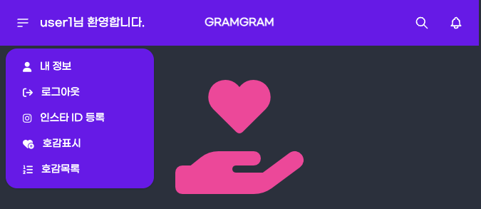

# Title: [1Week] 유동기

## 미션 요구사항 분석 & 체크리스트

---

- ## **미션 요구사항**
    - 필수 과제
       -> 호감 목록 페이지에서 특정 항목에 삭제 버튼을 누르면 삭제되는데
       삭제하기 전에 해당 항목에 대한 소유권이 로그인한 사람에게 있는지 체크한다.
    - 선택 과제
       -> 구글 로그인으로 가입 및 로그인 처리가 가능하도록 한다.
       스프링 oauth2 클라이언트로 구현한다.
        
- ## **체크리스트**
    - [x] 구글 로그인 + 네이버 로그인 구현
    - [x] 호감상대 삭제 Test case 만들기
    - [x] 호감상대 삭제 구현
    - [x] 호감상대 삭제 권한 확인 구현
    - [x] UI 개선
        - [x] 내비 바 추가
        - [x] 로그인, 회원가입 폼 가운데로 이동

 

### 1주차 미션 요약

---

**[접근 방법]**

- oauth2-client 라이브러리 사용하여 구현하였다. 구글의 경우 id와 secret만 입력해주면 되었다. yml파일을 따로 분리해 inclue = oauth을 적어주고 gitignore에
  추가하여 보안을 유지하였다.
- 테스트케이스는 NotProd에 이미 등록되어 있는 것을 활용하였다. user3으로 로그인하여 미리 user4에게 호감표시 해 놓은 것을 삭제하면 LikeablePersonController에서 delete 메서드를
  통해 삭제하고 삭제가 완료되면 호감목록으로 돌아가므로 3xx로 리다이렉트 된다. (실패하는 테스트 케이스 작성)
-  LikeablePersonService에서 id을 통해 LikeablePerson을 찾아서 삭제하였다. RsData를 활용하여 실패하면 실패 메세지를 보여주고 삭제에 성공하면 삭제가 완료되었다는
   메세지를 보여주었다. 실패의 경우에는 1차로 비어있는지, 2차로 권한이 있는지(과제 요구사항) 체크하였다. (테스트 케이스 성공)
- 권한이 있는지는 principal을 활용하였다. 현재 로그인 한 사람의 인스타정보에서 id와 LikeablePerson의 id를 비교하여 같으면 삭제하고 다르면 삭제할 수 없다는 메세지를 출력하였다.
- 내비바는 데이지 UI를 이용하고 로그인폼과 회원가입 폼 이동은 tailwind를 이용하면 되겠다고 생각했다.

**[특이사항]**

- 호감 목록에 있는 것을 삭제하는 기능 구현은 그동안 배운 것을 활용해 구현하는 것이라 어렵지 않았다.
하지만 제일 쉬울 줄 알았던 구글 로그인이 가장 문제였다. 계속 에러가 나서 찾아보던 중, openid라는 scope가 있을 경우 Open Id Provider로 인식한다고 한다. 그래서 scope=profile, email
을 추가해주었다. 구글은 OpenId Provider인 서비스이고 카카오, 네이버는 그렇지 않다고 한다. 추후에 아이디 찾기, 비밀번호 찾기를 구현해 볼 생각이다.
- 중간에 가벼운 실수들을 많이 하였다. delete 뒤에 id 가 들어오므로 delete/{id}와 같이 해야하는데 delete만 적었다. 아직 기본기가 부족한듯 하여 복습을 해야 할 것 같다.

> 참고 문서 : https://daisyui.com/ (데이지UI), https://tailwindcss.com/docs/ (테일윈드), https://developers.google.com/identity/protocols/oauth2/scopes?hl=ko (google)

+ [추가사항]
+ UI 개선
+ 

