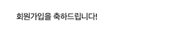
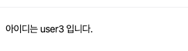
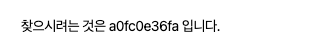
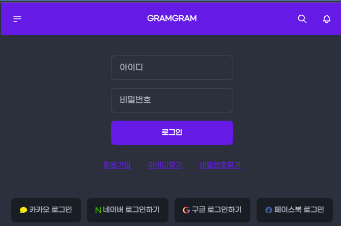
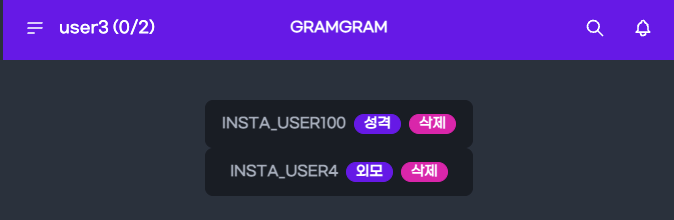
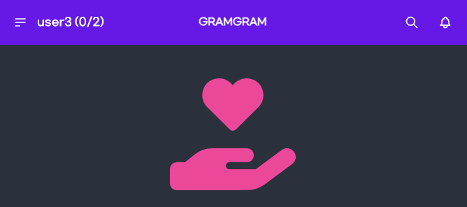
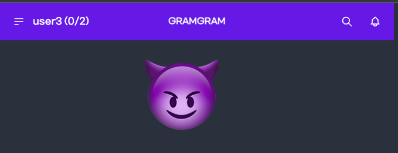
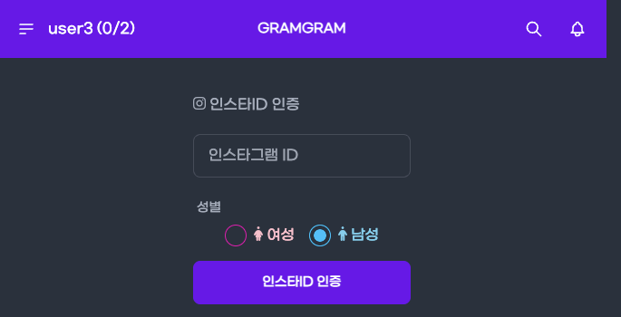
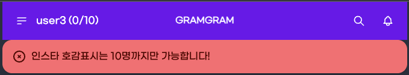
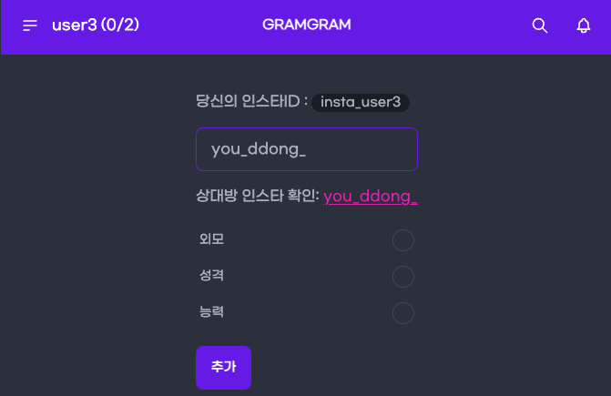

# Title: [2Week] 유동기

## 미션 요구사항 분석 & 체크리스트

---

- ## **미션 요구사항**
- 필수 과제
   케이스 4 : 한명의 인스타회원이 다른 인스타회원에게 중복으로 호감표시를 할 수 없습니다.
   -> 내 인스타 아이디가 aaaa이면 같은 사람에게 같은 사유(예시:외모)로 호감표시를 할 수 없다.
   케이스 5 : 한명의 인스타회원이 11명 이상의 호감상대를 등록 할 수 없습니다.
   케이스 6 : 케이스 4 가 발생했을 때 기존의 사유와 다른 사유로 호감을 표시하는 경우에는 성공으로 처리한다.
   -> 내 인스타 아이디가 aaaa이고 기존에 외모로 표시를 해놓았으면 같은 사람에게 다른 사유(예시:성격)로 호감표시를 변경할 수 있다.
  
- 선택 과제
   네이버 로그인으로 가입 및 로그인 처리가 가능하도록 한다.
   스프링 oauth2 클라이언트로 구현한다.
    
- 추가 과제
   회원가입시 축하 이메일 발송
   아이디 찾기시 이메일로 아이디 전송
   비밀번호 찾기시 아이디와 이메일 입력 후 이메일로 임시 비밀번호 전송
- ## **체크리스트**
    - [x] 이미 어떤 회원에게 호감표시를 하였을 경우 중복호감표시를 막도록 한다.
      -[x] testcase 작성
    - [x] 한명의 인스타회원이 11명 이상의 호감상대를 등록 할 수 없다. 
      -[x] testcase 작성
    - [x] 기존에 표시한 사유와 다른 사유로 호감을 표시하는 경우는 가능하도록 한다. + 추가되는 것이 아니라 기존의 것을 변경한다.
      -[x] testcase 작성
    - [x] 네이버 로그인으로 가입 및 로그인 처리가 가능하도록 한다 + json 파싱
    - [x] 회원가입시 축하 이메일 발송
    - [x] 아이디 찾기시 이메일로 아이디 전송
    - [x] 비밀번호 찾기시 아이디와 이메일 입력 후 이메일로 임시 비밀번호 전송

 

### 2주차 미션 요약

---

**[접근 방법]**
- 케이스 4번: LikeablePersonController의 add메서드를 통해 호감 표시를 진행하면 service에서 중복호감표시를 막도록 하였다.
  - 존재 여부만 확인하면 되니 레포지토리에 existsBy를 활용하여 이미 호감표시를 하였는지 체크하였다.
  - boolean existsByFromInstaMemberIdAndToInstaMemberUsername(Long id, String username); 추가
  - ToInstaMemberUsername은 임시방편일 뿐 사용하지 않고 ToInstaMember_username으로 수정하였다.
  

- 케이스 5번: 11명 이상의 호감상대를 등록 못하도록 하는 방법은 fromLikeablePeople의 사이즈를 체크하여 11이상일 경우 못하도록 하였다.
  - 다음과 같이 서비스에서 걸러주었다. member.getInstaMember().getFromLikeablePeople().size() >= 10 
  - 하드코딩이 아닌 타임리프로 해결하는 방법도 시도해보았다. th:if 와 .yml, Appconfig에 등록해 놓은 10명을 사용하여 10명째에 
호감표시를 하려는 순간 호감표시 창이 아닌 경고창을 띄워주도록 하였다.
  
- 케이스 6번
  - 처음에는 호감 사유만 다르면 변경이 아니라 추가로 잘못 생각하여 boolean existsByFromInstaMemberAndToInstaMemberUsernameAndAttractiveTypeCode(InstaMember fromInstaMember, String username, int attractiveTypeCode) 
    이 코드로 있는지 체크 후에 없으면 추가하도록 하였다.
  - 하지만 추가가 아닌 변경으로 깨닫고 나서는 findBy로 찾아서 .isPresent로 있을 경우 호감사유가 같으면 historyback, 
    다르면 update를 하도록 하였다.
  
- 선택미션: 네이버는 스프링 시큐리티를 공식 지원하지 않는다고 한다. 그래서 다 수동으로 입력해주었다.
  - Registration에 client-id, secret, redirect-uri, authorization-grant-type, client-name
  - provider에 authorization-uri, token-uri, user-info-uri, user-name-attribute 을 입력해주어야 한다.
  - 네이버 회원 조회시에 반환되는 json 형태에서 response 안에 있는 id를 가져와야 한다. (Map 사용)

- 추가
  - 회원가입시 이메일 발송: 이메일 발송은 구글의 smtp를 사용하였다. 구글링을 열심히 하여 의존성을 찾았고 사용해야할 클래스를 겨우 찾아내어 이것저것 시도해보고 성공하였다.(엄청 오래걸렸다.)
  - 아이디 찾기시 이메일로 아이디 전송: 회원가입시 이메일 입력 폼도 추가하였고 이메일을 입력해서 있을경우 아이디를 이메일로 전송하였다.
  - 비밀번호 찾기시 아이디와 이메일 입력 후 이메일로 임시 비밀번호 전송: 비밀번호 찾기로 들어가면 아이디와 이메일을 입력하게 하였고 일치하는 회원이 있을 경우 임시 비밀번호를 UUID로 생성하여 이메일로 전송
    하고 다시 암호화 해주었다.
  - UI도 개선해주었다.
  - onkeyup을 활용하여 호감표시하기 전에 인스타그램 링크로 이동 상대방의 인스타를 확인 할 수 있게 하였다.

**[특이사항]**

- 네이버는 JSON 형태로 반환되어 이것을 처리하는데 많은 생각을 한 거 같다. 처음에는 JSONObject 클래스가 있는 라이브러리를 사용해보려고 했는데 
  코드가 점점 복잡해져서 그냥 Map을 사용하였다.
- 이번 미션은 진행하면서 다양한 방법들이 떠올라서 좋았던거 같다. 그 중 나에게 가장 맞는 방법을 찾는 과정에서 많이 발전한거 같다.
- 추후 리팩토링시에 지금 프로그램은 이메일로 글자만 전송하지만 MimeMessage를 활용해 html도 전송해볼 생각이다.

> 참고 문서 : https://nerdcave.com/tailwind-cheat-sheet (테일윈드) https://support.google.com/mail/answer/185833 (구글 이메일 발송) https://www.baeldung.com/spring-email (스프링 이메일 발송)

[추가사항]
+ 회원가입시 축하 이메일 발송
+ 
+ 아이디 찾기시 이메일로 아이디 전송
+ 
+ 비밀번호 찾기시 아이디와 이메일 입력 후 이메일로 임시 비밀번호 전송(UUID 활용)
+ 
  
+ UI 개선
+ 로그인 페이지에 아이디 찾기, 비밀번호 찾기
+ 
+ 호감 목록
+ 
+ swap 기능 추가
+ 
+ 클릭하면 변한다
+ 
+ 인스타ID 인증 UI개선
+ 
+ 10명 호감표시 후에 인스타 호감표시 하러 들어가면 경고창
+ 
+ 호감표시 전에 상대방 인스타 확인하기 (링크 클릭시 이동)
+ 

