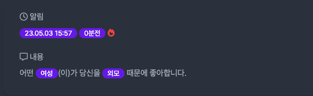

# Title: [3Week] 유동기

## 미션 요구사항 분석 & 체크리스트

---

- ## **미션 요구사항**
- 필수 과제
    호감표시/호감사유변경 후, 개별 호감표시건에 대해서, 3시간 동안은 호감취소와 호감사유변경을 할 수 없도록 작업
    네이버 클라우드 플랫폼을 통한 배포(도메인 없이, IP로 접속)

  

- 선택 과제
    알림기능 구현
    호감표시를 받았거나, 본인에 대한 호감사유가 변경된 경우에 알림페이지에서 확인이 가능하도록 한다.
    각각의 알림은 생성시에 readDate 가 null 이고, 사용자가 알림을 읽으면 readDate 가 현재날짜 로 세팅되어야 한다.
    

- ## **체크리스트**
    - [x] 호감사유 변경 가능시간 백엔드에서 체크
    - [x] 호감취소 가능시간 백엔드에서 체크
    - [x] 호감 목록에 몇 시간 몇 분 후에 변경 취소 가능한지 표시
    - [x] 알림 기능 구현
      - [x] 호감 표시 (like) 알림
      - [x] 호감 사유 변경 (modify) 알림
      - [x] 알림 확인 시 readDate가 현재 날짜로 세팅
    - [x] 네이버 클라우드 플랫폼을 통한 배포(도메인 없이, IP로 접속)
      - [x] 도메인 사용하기

 

### 3주차 미션 요약

---

**[접근 방법]**
- 호감표시/호감사유변경 후, 개별 호감표시건에 대해서, 3시간 동안은 호감취소와 호감사유변경을 할 수 없도록 작업
  - canLike, canCancel 메소드에서 현재 시간이 3시간 쿨타임적용된 시간이 지났는지 체크
  - canLike은 호감표시창에서 호감표시만 다르게 변경하여 적용할때인 checkAttractiveAndUpdate 메서드랑, 호감목록에서 호감표시 변경하는 canModifyAttractiveAtList 메서드에 적용
  - canCancel은 호감목록에서 호감취소하는 cancel 메서드에 적용
  - 호감 목록에 몇 시간 몇 분 후에 변경 취소 가능한지 ChronoUnit을 활용 (ChronoUnit.HOURS, ChronoUnit.MINUTES)
  

- 선택미션: 알림기능 구현
    - spring event 활용하여 like, modify 발생할 때 event listener를 통하여 NotificationService에서 notification entity에 저장
    - 알림 표시를 눌러서 notification/list에 들어가면 null인 알림들만 찾아서 readDate를 현재 시간으로 업데이트
    - 타임리프를 활용하여 list UI 도 구현
    

- 네이버 클라우드 플랫폼을 통한 배포(도메인 없이, IP로 접속)
  - 네이버클라우드 플랫폼에서 서버 생성 (CentOS) , ACG 설정 (여러 포트들)
  - 포트포워딩으로 리눅스 접속 포트 설정하고 공인 IP 할당받기
  - ssh 접속하여 리눅스에서 git, DB, docker 준비하고 내 프로젝트 빌드하여 docker image 생성
  - 도메인 구매하여 a 레코드 설정 (IP)
  - NPM 활용하여 연결
  

**[특이사항]**

- 호감 쿨타임 표시는 UI로 구현되어 있어 백엔드에서 구현하기 보다 쉬웠던 거 같다.
- 알림 기능은 처음에는 그냥 냅다 다 list 가져와서 때려 넣을까 생각하다가 spring event 활용하여 그때그때 알림이 오면 좋을 거 같다는 생각이 들자마자 금방 구현하였다.
- 한번 실수로 commit을 되돌리다가 그동안 했던 작업이 다 날라가서 다시 작업하느라 시간이 많이 소요되었다. 백업은 필수인듯 하다...
> 참고 문서 : https://www.gabia.com/ (도메인 구매한곳)

[추가사항]
+ 
+ 알림 기능 UI

