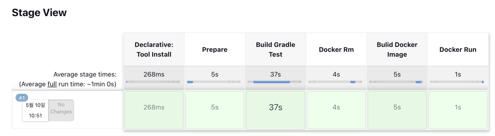

# Title: [4Week] 유동기

## 미션 요구사항 분석 & 체크리스트

---

- ## **미션 요구사항**
- 필수 과제
    네이버클라우드플랫폼을 통한 배포, 도메인, HTTPS 까지 적용 (3주차에서 완료 www.ddonggi.com)
    내가 받은 호감리스트(/usr/likeablePerson/toList)에서 성별 필터링기능 구현

  

- 선택 과제
    내가 받은 호감리스트(/usr/likeablePerson/toList)에서 호감사유 필터링기능 구현
    내가 받은 호감리스트(/usr/likeablePerson/toList)에서 정렬기능
    젠킨스를 통해서 리포지터리의 main 브랜치에 커밋 이벤트가 발생하면 자동으로 배포가 진행되도록 하기
    

- ## **체크리스트**
    - [x] 내가 받은 호감 리스트에서 성별 필터링 구현
      - [x] 내가 받은 호감 리스트에서 성별 필터링 테스트 만들기
    - [x] 내가 받은 호감 리스트에서 호감사유 필터링 구현
      - [x] 내가 받은 호감 리스트에서 호감사유 필터링 테스트 만들기
    - [x] 내가 받은 호감 리스트에서 정렬기능 구현
    - [x] 젠킨스를 통해서 리포지터리의 main 브랜치에 커밋 이벤트가 발생하면 자동으로 배포가 진행되도록 하기
      - [x] 네이버 클라우드 플랫폼 서버의 centOS에서 docker로 젠킨스 설치하고 nginx 리버스 프록시로 8081로 연결
      - [x] 젠킨스에서 자바17, docker 설치하고 git 연결
      - [x] 젠킨스에서 배포를 위한 파이프라인 만들기
    

 

### 4주차 미션 요약

---

**[접근 방법]**
- 필수미션: 내가 받은 호감리스트(/usr/likeablePerson/toList)에서 성별 필터링기능 구현
  - 처음에는 POST 방식으로 조회 버튼을 만들어서 성별을 받아와서 필터링을 하였다. 
  - 그러나 GET 방식이 더 적합하다고 생각하여 GET 방식으로 쿼리스트링으로 성별을 받아와서 필터링을 하였다.
  - 컨트롤러에서 서비스의 toListFilter 메서드를 사용하여 필터링을 하였다.
  - toListFilter에서 filterByGender 메서드를 사용하였고 스트림을 사용하여 필터링 하였다. 주석처리해놓고 for문으로도 구현해놓았다.
  

- 선택미션1: 내가 받은 호감리스트(/usr/likeablePerson/toList)에서 호감사유 필터링기능, 정렬 구현 
    - 필터링기능은 필수미션과 같이 쿼리스트링으로 받아와서 필터링을 하였다.
    - 성별 필터링 기능과 같이 컨트롤러에서 서비스의 toListFilter(매개변수 3개 받는다) 메서드를 사용하여 필터링을 하였다.
    - filterByAttractiveType 메서드를 사용해 호감사유에 따른 필터링을 하였고 스트림을 사용하였다.
    - filterBySortCode 메서드를 사용해 정렬을 하였고 정렬 기준을 새로 정의할 수도 있으므로 LikeablePerson에 Comparable을 implements하여 sort 하였다.
    

- 선택미션2: 젠킨스를 통해서 리포지터리의 main 브랜치에 커밋 이벤트가 발생하면 자동으로 배포가 진행되도록 하기
  - nginx에서 리버스 프록시를 활용하여 8081로 연결하였다.
  - 젠킨스에서 자바17, docker 설치하고 git 연결하였다.
  - 자동화를 위한 파이프라인을 만들었고 push가 발생할때마다 자동으로 배포가 진행되도록 하였다.
  

**[특이사항]**

- 성별 필터링을 하는도중에 attrativeTypeCode로 인자를 받아와야하는데 attrativeType으로 착각하고 계속 오류가 났었다. 오타인지 모르고 null이 계속 들어오길래
  다른 문제로 착각하여 시간을 많이 날렸다. 오타를 잘 확인하자.

[추가사항]
+ 
+ 젠킨스 파이프라인으로 배포 자동화를 구현 완료한 모습.

